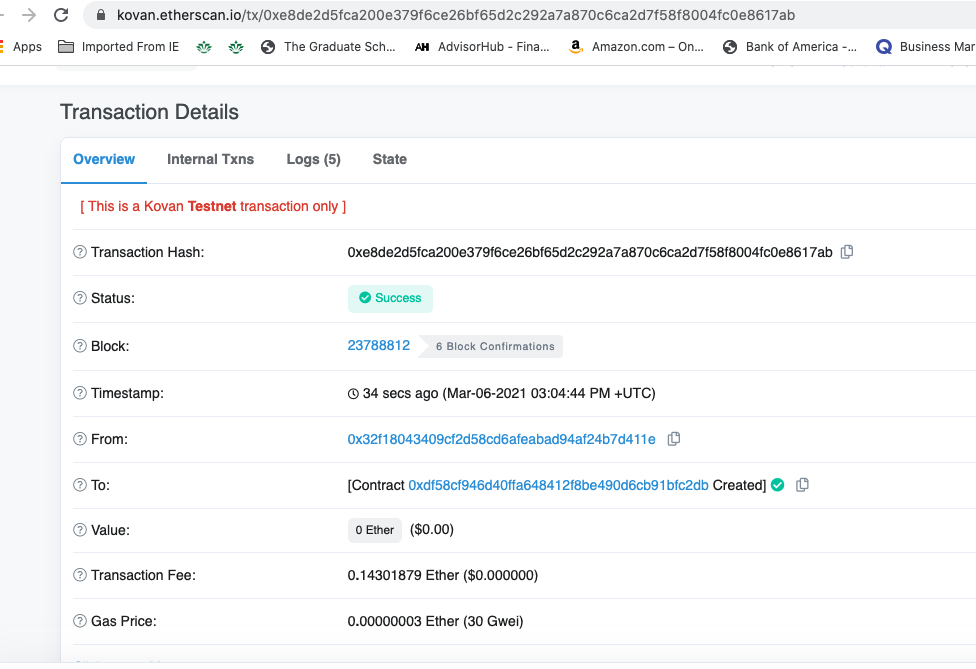

# Minting an ERC-20 Token

In this project, we create an ERC20 token that is minted through a Crowdsale contract that can be leveraged from the OpenZeppelin Solidity library. 

This crowdsale contract manages the entire process, allowing users to send ETH and get back PUP (PupperCoin). This contract mints the tokens automatically and distributes them to buyers in one transaction. 

Using Remix, we create a file called PupperCoin.sol and create a standard ERC20Mintable token.

We also conduct the crowdsale on the Kovan or Ropsten testnet in order to get a real-world pre-production test in.

## Proof of Transaction
